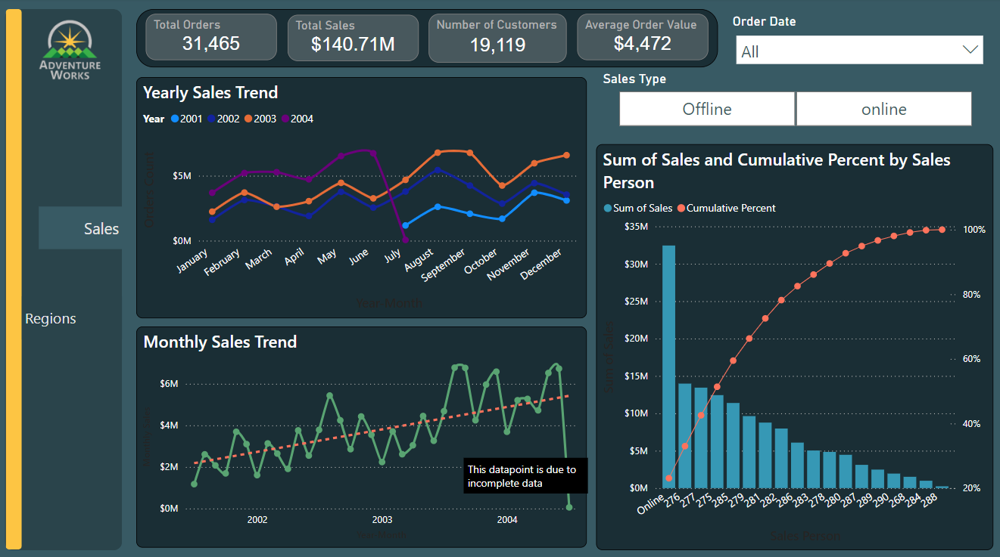

# Communicating Analysis Results: Power BI

## Introduction
In this project, I created a new dashboard by amending the that from the Hands-On practice to demonstrate my skills in power BI and derive some insights from the **Adventureworks Database**.

[Here](PowerBI_Project.pbix) is the Power BI file, and I have also documented the sql queries in [this file](Queries.sql)
## Problem Statement : ASK PHASE
- How is the business doing in sales on a monthly basis? How does it compare with Orders placed?
- How does Online orders and sales compare to Offline
- Does the salesrep sales volume follow the Pareto principle?
- Which country had the highest sales (with breakdown by regions and Province)?

## PREPARE PHASE
I connected Power BI to BigQuery to query the required data.
1. The **SalesOrderHeader** table. The Query: `SELECT * FROM tc-da-1.adwentureworks_db.salesorderheader `
2. The **Regions** table.
   The Query:
   ```
   SELECT 
    DISTINCT CustomerID,
    territory.Group,
    Name AS Region,
    CountryRegionCode AS Country,
    FROM tc-da-1.adwentureworks_db.salesorderheader soh
    JOIN adwentureworks_db.salesterritory as territory ON soh.TerritoryID = territory.TerritoryID 
    ```
   
3. The **Province** table which holds the stateprovince and Total Due.

## PROCESS PHASE
1. I removed irrelevant columns especially from the salesorderheader table.
2. I created the following measures:
   - Average Order Value with DAX: `Avg Order Value = [TotalSales]/salesorderheader[Orders Count]`
   - Total Sales : `TotalSales = SUM('salesorderheader'[TotalDue])`
   - Unique Customers : `Unique Customers = DISTINCTCOUNT(salesorderheader[CustomerID])`
3. I created a calculated table **Sales Person**:
   ```
   Sales Person = SUMMARIZE(
    salesorderheader,
    salesorderheader[Salesperson Type],
    -- Additional group by columns if needed
    "Sum Sales", SUM(salesorderheader[TotalDue])  -- Define calculated columns
    -- More calculated columns if needed
    )
   ```
4. I created a calculated column **Ranking** in the Sales Person table: `Ranking = RANKX(  'Sales Person',   'Sales Person'[Sum Sales])`
5. Created a relationship between SalesOrderHeader and Regions tables on the **CustomerID** column.

## ANALYZE PHASE
I created a dashboard to communicate the insights. 

The dashboard contains Line charts, tables, Pareto Chart, tables, Treemap, Map, filters and visaul cards.

I also included bookmarks and buttons for easier page navigation.

Refer to the file to view.

## SHARE (Conclusion)
Here are the following insights derived:
1. 1. The data reveals a consistent seasonal sales pattern across the years, with August being the peak month for sales and January and October experiencing the lowest sales volume.

2. There's a clear seasonal trend with August showing high sales in each of the three years. This suggests a potential link between the product and summer months.

3. January and October consistently have the lowest sales figures, indicating a potential post-holiday slump (January) and pre-holiday lull (October) in customer buying behavior.
4. There is a massive 400% increase in order volume from 2003 to 2004.
   
5.  A high percentage of orders were placed online (87%) but a larger portion of the sales revenue comes from offline channels (76%). 
   This is perhaps due to High Order Value Offline where Customers might be placing smaller orders online (e.g., for refilling supplies) and making larger, more expensive purchases offline (e.g.,experiencing the product firsthand).
6. According to the Pareto chart, 9 sales persons(50%) were responsible for 80% of all sales. This does not follow the 80/20 rule.
7. The United States drives over 50% of total sales with an everage order value of $6,845 which is 53% higher than that of the business #4,472.


## ACT PHASE(Recommendation)
1. Targeted Marketing: Develop targeted marketing campaigns to address the low sales periods. 
      For example, January promotions could encourage post-holiday purchases, and October campaigns could highlight the benefits of buying early before the holiday rush.

2. Identify Growth Drivers: The business should focus on pinpointing the primary factors that led to the order increase. This will help replicate the success in future strategies.

3. Scalability Assessment: The business should ensure that infrastructure (production, inventory, customer service) can handle the increased order volume. Invest in scaling up if necessary.

4. Encourage Larger Online Orders: Implement promotions or incentives that encourage customers to make larger purchases online. 
    This could involve free shipping thresholds, bundled product discounts, or loyalty programs.

5. Improve Online Customer Experience: Streamline online checkout process, offer clear product decription and high-quality images, and provide excellent customer service to build trust and encourage online purchases.
6. Premium Pricing: Consider a premium pricing strategy for the U.S. market, as customers are already spending significantly more per order.
7. Loyalty Programs: Implement or enhance loyalty programs specifically designed for U.S. customers to encourage repeat purchases.

8. Targeted Marketing Campaigns: Develop targeted marketing campaigns to increase brand awareness and product visibility in the underperforming regions.

For Further Analysis:
1. Customer Segmentation Analysis and Customer Lifetime Value Analysis of US customers.
2. Further analysis into the massive increase in orders from 2002 to 2003. To check if there were any new product launches or updates that spurred customer interest or any external factors, such as economic conditions or industry trends, that could have influenced purchasing behavior.

